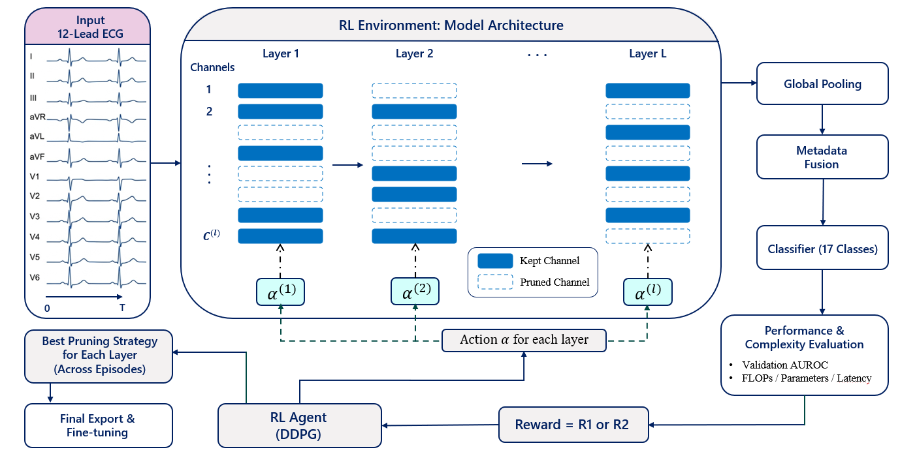

# Automated Pruning for Lightweight ECG Classifiers Using Reinforcement Learning

[](https://www.python.org/downloads/)
[](https://pytorch.org/)
[](https://opensource.org/licenses/MIT)

Reinforcement learning based structural channel pruning for lightweight multi-label 12-lead ECG classification on resource-constrained Edge AI devices.

<p align="center">
  
</p>

---

## 🎯 Key Results

| Model                  | Compression | Model Size | ID AUROC          | OD AUROC          |
| ---------------------- | ----------- | ---------- | ----------------- | ----------------- |
| Original MobileNetV2   | --          | 9017 KB    | 0.91 / 0.92       | 0.91 / 0.92       |
| **Pruned MobileNetV2** | **90%**     | **539 KB** | **0.927 / 0.970** | **0.912 / 0.933** |
| Original SE-ResNet18   | --          | 34594 KB   | 0.95 / 0.98       | 0.91 / 0.92       |
| **Pruned SE-ResNet18** | **99%**     | **337 KB** | **0.954 / 0.980** | **0.931 / 0.934** |

---

## ✨ Features

* Reinforcement learning based automated channel pruning
* DDPG-based continuous pruning policy optimization
* Residual-aware structural pruning constraints
* Real structural model reconstruction during RL optimization
* Budget-constrained and unconstrained pruning policies
* In-distribution and out-of-distribution evaluation

---

## 📁 Project Structure

```text
RL_ECG_Pruning/
│
├── mobilenetv2_search.py          # RL pruning search        
├── env/
│   ├── ecg_channel_pruning_env.py
├── lib/
│   ├── agent.py                   # DDPG agent
│   ├── memory.py                  # Replay buffer
│   └── utils.py
├── scripts/
│   ├── run_search.sh
├── src/
│   ├── modeling/models/mobilenetv2.py
│   └── dataloader/
└── README.md
```

---

## 🚀 Quick Start

### Installation

```bash
git clone https://github.com/UTU-Health-Research/RL_ECG_Pruning.git
cd RL_ECG_Pruning

pip install -r requirements.txt
```

---

## 🔍 RL-Based Pruning Search

```bash
bash scripts/run_search.sh
```

### SE-ResNet18 Search


---

## 🔧 Fine-Tuning

```bash
python fine_tune.py
```

---

## ⚙️ Search Configuration

Example search parameters:

```bash
# Compression target
PRESERVE_RATIO=0.1   # Keep 10% FLOPs
LBOUND=0.05
RBOUND=1.0

# RL training
WARMUP=100
MAX_EPISODES=600

# DDPG
LR_A=1e-4
LR_C=1e-3
```

---

## 🧠 Framework Overview

The proposed framework:

1. Trains a one-dimensional ECG classification model
2. Uses DDPG to learn layer-wise channel preservation ratios
3. Applies pseudo-pruning during RL exploration
4. Builds and evaluates real structurally pruned models
5. Preserves residual consistency during pruning
6. Exports and fine-tunes the compact model

---

## 🔗 Residual-Aware Structural Pruning

Residual connections require compatible tensor dimensions during addition operations:

```text
Input ──┬── Conv ── Conv ──┬── Output
        │                  │
        └──── Identity ────┘
                 ↑
     Shared channel indices
```

The proposed framework preserves identical channel structures across layers connected through the same residual pathway.

---

## 📊 Evaluation

The framework was evaluated using:

* PhysioNet/CinC 2021 datasets
* Shandong Provincial Hospital (SPH) dataset
* In-distribution evaluation
* Out-of-distribution evaluation

Metrics include:

* AUROC (Macro / Micro)
* FLOPs reduction
* Model size
* Inference latency

---

## 📚 Citation

If you use this repository in your research, please cite:

```bibtex
@article{RL_ECG_Pruning,
  title={Automated Pruning for Lightweight ECG Classifiers Using Reinforcement Learning},
  author={...},
  journal={...},
  year={....}
}
```

---

## 📄 License

This project is released under the MIT License.

---

## 🙏 Acknowledgments

University of Turku
Digital Health Technology Group

GitHub:
[https://github.com/UTU-Health-Research/RL_ECG_Pruning](https://github.com/UTU-Health-Research/RL_ECG_Pruning)
